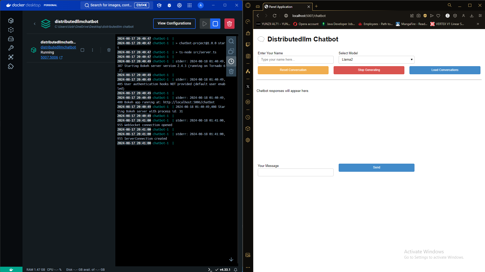
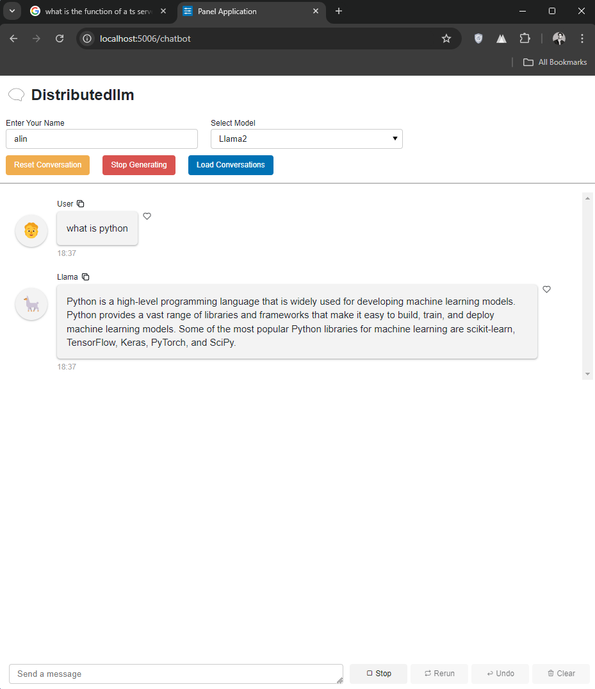

### This project is a Dockerized chatbot application using LLama2 And Mistral

## Features

- **Model Selection**: Choose between Llama2 and Mistral models for generating responses.
- **Conversation History**: Save and retrieve conversation history for different users using SQLite databases.
- **Custom Chat Interface**: A user-friendly chat interface built using `panel` components.
- **Stop and Reset**: Stop the response generation at any time and reset the conversation history.


## Prerequisites

- Docker
- Docker Compose
- If you do not want to use docker, The entire program can be started usind a single `npm start` command.







## Project Structure

```
.
├── Dockerfile               # Dockerfile to build the container
├── docker-compose.yml       # Docker Compose configuration
├── chatbot.py               # Main Python script for the chatbot
├── package.json             # Node.js package configuration
├── tsconfig.json            # TypeScript configuration
├── src
│   └── server.ts            # TypeScript server entry point
└── conversations/            # Directory for storing SQLite databases
```

## Setup Instructions

### 1. Clone the Repository

Clone this repository to your local machine:

```bash
git clone https://github.com/alinanjum1999/distributedllm.git
cd distributedllm-chatbot
```

### 2. Build the Docker Container

Use Docker Compose to build the container:

```bash
docker-compose up --build
```

This command will:

- Install Node.js dependencies (including TypeScript and `ts-node`).
- Install Python dependencies (`panel`, `ctransformers`, and `pyyaml`).
- Set up the environment and start the application.

### 3. Run the Application

After the build is complete, you can start the application:

```bash
docker-compose up
```

The application should now be accessible at:

- **Chatbot Interface**: `http://localhost:5700` (Note: WebScout does not allow the chatbot to run on port 5600, so it runs on 5700 instead. Check DOOCKERFILE FOR more information)
- **TypeScript Server**: on another port (e.g., `http://localhost:3000`)

### 4. Interacting with the Chatbot

- **Enter Your Name**: Start by entering your name in the input box. This will be used to save and load your conversation history.
- **Select Model**: Choose between Llama2 and Mistral models from the dropdown menu.
- **Send Messages**: Type your message in the input box and click "Send" to interact with the chatbot.
- **Reset Conversation**: Click "Reset Conversation" to reset the current conversation history.
- **Stop Generation**: Click "Stop Generating" to stop the chatbot from generating a response.
- **Load Conversations**: Click "Load Conversations" to retrieve past conversations associated with your name.

### 5. Accessing Conversation History

- All conversation histories are saved in SQLite databases located in the `conversations` directory. Each user's conversations are stored in a separate database file named `<username>_chatbot.db`.

## Technical Details

### `chatbot.py`

The `chatbot.py` script handles the main functionality of the chatbot, including:

- **Model Loading**: Models are loaded using `ctransformers` and cached to avoid reloading.
- **Context Management**: The chatbot uses a sliding window approach to manage context within a specified maximum length.
- **Database Management**: SQLite databases are used to store and retrieve conversation history.

### TypeScript Server

The `src/server.ts` file starts the TypeScript server, which launches the `panel` server as a subprocess using `child_process.spawn`. This server handles routing and any additional logic required for the application.

### Dockerfile

The `Dockerfile` sets up both the Python environment and Node.js environment required to run the application. It installs necessary dependencies and ensures the application is ready to start when the container is launched.

### Environment Configuration

The `BOKEH_ALLOW_WS_ORIGIN` environment variable is used to allow WebSocket connections for the Bokeh server (part of `panel`). This ensures that the application can be accessed from the correct origin.

## Troubleshooting

- **Port Conflicts**: If you encounter port conflicts, you may need to adjust the port mappings in the `docker-compose.yml` file.
- **Model Loading Issues**: If a model fails to load due to missing files, ensure that the model paths and files are correctly specified in the `MODEL_ARGUMENTS` dictionary.
- **Database Errors**: If you encounter issues with saving or loading conversations, verify that the `conversations` directory is writable and that the SQLite databases are correctly structured.

## License

This project is licensed under the MIT License. See the [LICENSE](LICENSE) file for more details.

## Contributing

Contributions are welcome! Please submit pull requests or open issues on the GitHub repository.
"
