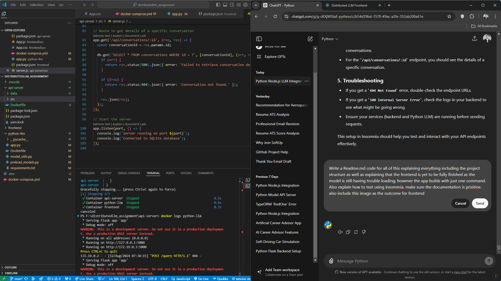

# Distributed LLM Assignment

This project includes a Python application and a Node.js API server designed to interact with Llama2 and Mistral models. The project features Docker integration to ensure that both the frontend and backend services can be built and run with a single command.

## Project Structure

```
distributedllm_assignment/
│
├── api-server/
│   ├── src/
│   │   ├── server.js       # Node.js API server handling requests and communicating with Python LLM
│   ├── package.json        # Dependencies and scripts for the API server
│   ├── package-lock.json
│
├── frontend/
│   ├── src/
│   │   ├── App.js          # Main React component
│   │   ├── index.js        # React entry point
│   │   ├── App.css         # Styles for the React app
│   │   └── index.css       # Global styles
│   ├── package.json        # Dependencies and scripts for the frontend
│   ├── package-lock.json
│   ├── public/
│   │   └── index.html      # The HTML template for React
│
├── python-llm/
│   ├── app.py              # Python Flask app serving Llama2 and Mistral models
│   ├── model_utils.py      # Helper functions to load models
│   ├── requirements.txt    # Python dependencies
│
├── .env                    # Environment variables for Hugging Face API token and other configurations
├── Dockerfile              # Dockerfile for Python LLM service
├── docker-compose.yml      # Docker Compose file to build and run all services
└── README.md               # Project documentation
```

## Prerequisites

Ensure you have the following installed:

- Docker
- Docker Compose

## Setting Up the Project

1. **Clone the Repository:**

   ```bash
   git clone <repository-url>
   cd distributedllm_assignment
   ```

2. **Set Up Environment Variables:**

   Create a `.env` file in the root directory and add the following variables:

   ```env
   HUGGINGFACE_API_TOKEN=<your_huggingface_api_token>
   ```

3. **Build and Run the Project:**

   Run the following command to build and start all services (frontend, backend, Python LLM) using Docker Compose:

   ```bash
   docker-compose up --build
   ```

   The backend will run on port `4000`, the Python LLM service on `5000`, and the frontend on `3000` or the port you specified.

## Testing the API with Insomnia

### 1. **Install Insomnia:**

   Download and install Insomnia from [Insomnia's official website](https://insomnia.rest/download).

### 2. **Create a New Workspace:**

   - Open Insomnia.
   - Click on "Create" > "New Request Collection."
   - Name the collection (e.g., "LLM API Test").

### 3. **Add Requests:**

   #### 1. **Test `/api/query` Endpoint:**

   - **Method:** POST
   - **URL:** `http://localhost:4000/api/query`
   - **Body:** JSON

   ```json
   {
     "model": "llama2",
     "query": "What is the weather today?"
   }
   ```

   #### 2. **Test `/api/conversations` Endpoint:**

   - **Method:** GET
   - **URL:** `http://localhost:4000/api/conversations`

   #### 3. **Test `/api/conversations/:id` Endpoint:**

   - **Method:** GET
   - **URL:** `http://localhost:4000/api/conversations/1`

### 4. **Send Requests and Verify Responses:**

   - **POST `/api/query`:** Expect a response from the Python LLM.
   - **GET `/api/conversations`:** Expect a list of conversation histories.
   - **GET `/api/conversations/:id`:** Expect detailed information about a specific conversation.

## Current Status

- The **frontend** is still under development. There are issues with the model loading, but the app successfully builds and runs with Docker Compose.
- The **backend** can successfully interact with the Python LLM and store conversations in the SQLite database.
  
### Frontend Outcome

The current frontend outcome is shown below:



### Docker Compose Outcome

When you run `docker-compose up --build`, you should see output similar to the following:

```bash
api-server  | Server running on port 4000
api-server  | Connected to SQLite database
frontend    |  INFO  Accepting connections at http://localhost:3000
python-llm  |  * Serving Flask app 'app'
python-llm  |  * Debug mode: off
```

If the frontend runs on a different port, adjust the URL accordingly when testing with Insomnia.

## Troubleshooting

- **404 Not Found:** Check endpoint URLs and ensure the Python LLM service is running.
- **500 Internal Server Error:** Check the backend logs for issues.
- Ensure all services are running before sending requests.

## Conclusion

This project demonstrates how to build a distributed application with a Python LLM, Node.js API server, and React frontend. The frontend is still under construction, but the backend and Python LLM services are functional and can be tested using Insomnia.
